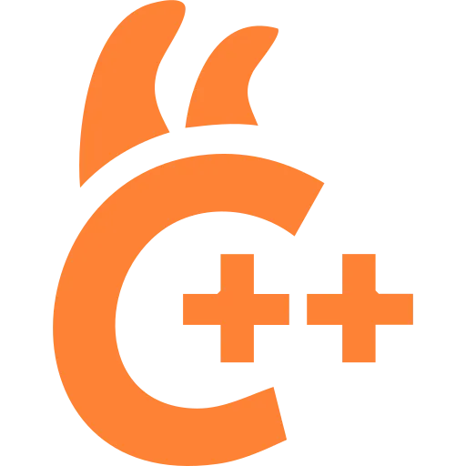
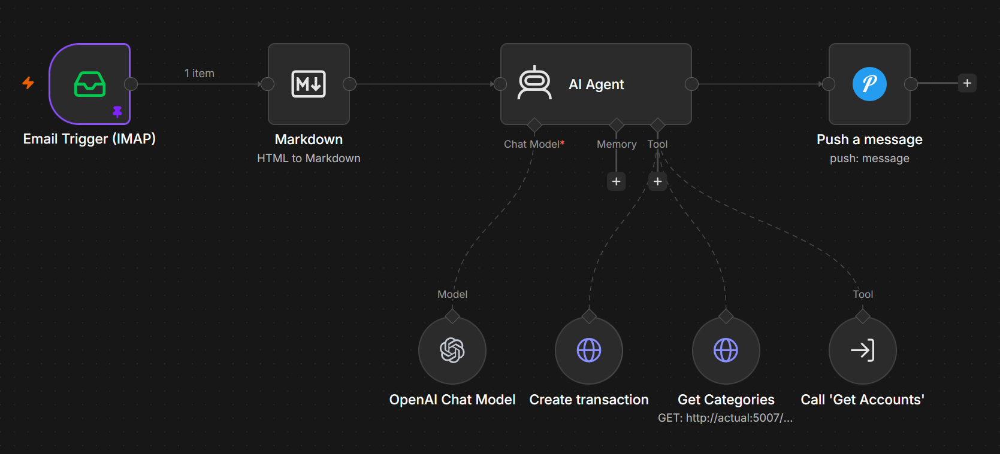

+++
title = "Personal Finance Automation and Self-hosted LLM"
description = "My experience on using self-host LLM on n8n to automate tracking expense"
date = 2026-05-29
+++

||||
|--|--|--|

Tracking expenses is tedious, it's exciting at first but I always find myself stop tracking after few days. I'm using [Actual Budget](https://actualbudget.org/) because it's a self-hosted software and recommended by many, I don't really use the [envelop budget](https://actualbudget.org/docs/getting-started/envelope-budgeting/) but it also have [tracking](https://actualbudget.org/docs/getting-started/tracking-budget) which I use instead.

## Automating Tracking Expense in Actual Budget

Actual Budget itself don't have any HTTP API I can interact with, while they provide NPM packages to interact with Actual Budget it's limited to platform where you able to use npm package. Since I'm planning to use it with Shortcut, that's not an option, luckily someone built [it](https://github.com/jhonderson/actual-http-api). I know Actual Budget have [bank sync](https://actualbudget.org/docs/advanced/bank-sync/), but it only works for North America, European, and Brazillian bank.

Before I got the time to working with it, I encountered a Reddit [post](https://reddit.com/r/selfhosted/comments/1ss09kn/selfhosted_personal_finance_automation_n8n_actual) sharing their workflow using n8n, actual budget, Claude, and simplefin to automate their personal finance. I then realized that every transaction from my bank is sent to my email and n8n have [email trigger](https://docs.n8n.io/integrations/builtin/core-nodes/n8n-nodes-base.emailimap/) that I can connect to n8n and have it tracking my expense for me. While the post describing using Claude to auto categorize the transaction, I'm using the LLM to read the email and insert the transaction to Actual Budget and push a notification via [Pushover](https://pushover.net/).

## Setup

Here is the workflow I use to automate expense tracking from my email to actual budget. The AI Agent node here is optional, I can replace it with multiple if else branch depending on subject and sender, and it will be faster each execution.

### Actual Budget as Tool

At first I'm using [actual mcp](https://github.com/s-stefanov/actual-mcp) as connected tool of the AI Agent. The problem is I need an API not exposed by the MCP server. Most of the transaction notification is email is using account/card number, but I certainly don't use number as account's name in Actual Budget, so I put account name and number in the account's note and feed that note to the agent.

I have multiple approach to solve this,

1. I can fork the mcp then make some adjustment for my usecase.
2. Write my own mcp, or
3. Use http api as connected tool

I opted to use third option since it's the simplest and fastest way. I already have actual http api deployed anyway.

## Self-hosted LLM

While I'm not a privacy absolutist, I'm still councious of it. I'm not comfortable sharing (and paying) claude or any LLM provider to read my personal finance. Since I already have a server equipped with NVIDIA GTX 1660 Super running at home, I tried to self-host the LLM instead. There are a lot advancement in small local model, I know it's far from what frontier model capable of but I want to try if it can serve my use case. At first, I'm using Ollama to serve the LLM, but later settled with llama.cpp which ollama based on.

### Ollama

[Ollama](https://ollama.com/) is `The easiest way to build with open models` as they said on their web page. Ollama provide automatic model download, loading, unloading, and swap. While it is indeed easy, I can't get Ollama to run model 100% on GPU. Qwen 3.5 running 75% on GPU and 25% on CPU while Gemma 4 is the other way around, 25% on GPU and 75% on CPU even with only 8K context. I've read online that llama.cpp performs better, so I ditch Ollama and trying llama.cpp instead.

### llama.cpp

A lot of popular LLM software are based on [llama.cpp](https://llama-cpp.com/), Ollama and [LM Studio](https://lmstudio.ai/) are one of them. llama.cpp don't have what makes Ollama easy, but llama-server is able to automatically load/unload/swap model, those are enough for my use case.

## Local Models

There are actually plenty small local model available, but good models with tool calling is pretty limited in number.

### Gemma 4

There are a lot of hype for Gemma 4 and I want to see it for myself. Google release 2 small model variants for Gemma 4, E2B and E4B. both have instructions support. I'm using E4B variants for this workflow and found the model able to extract necessary information most of the time but still failed when creating a transaction sometimes because of the generated payload schema is wrong.

### Qwen 3.5

Alibaba also released good small model with good tool calling support, there are 4 small variants: 0.8B, 2B, 4B, and 9B. In test execution enviroments using 4B variants, I don't really notice difference in performance/result with Gemma 4. After running Gemma 4:E4B variant for few days, I currently switching to Qwen3.5:4B to see if the model have similar failure rate as Gemma 4.

## What's Next

For most of transactions this works great so far, the model guess most of the parameters correctly. It choose associated accounts in Actual Budget correctly, it also able to guess the category of some of the transactions. There are issues that remain unsolved, one of my banks sent incomplete information for transaction made using debit card and moving money between pockets. Email for moving money between pocket is split to moved money out of pocket and add money to one of pocket. What's worse is email for transaction using debit card only have amount and nothing else, not which debit card nor the payee. I may need to have the AI agent create the transaction with half information and update the transaction with different email to complete the information. Luckily, I don't often move money between pockets nor using the debit card of that bank.
