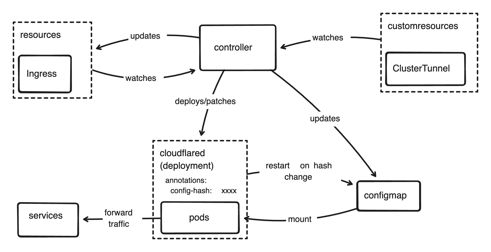

+++
title = "Write a Kubernetes Controller in Rust"
description = "Exposing kubernetes services to public internet with Cloudflare Tunnel using Kubernetes Operator and Ingress Resources"
date = 2024-11-19
updated = 2024-11-21
+++

I have many hobbies, homelab is one of them. Like many other homelabber, almost all of the time I use VPN to access services in my home. But, there's always some services we want to expose to public internet, may it be for convinience or necessity. In fact this very website is hosted on my homelab using Cloudflare Tunnel, the other use case is I need to expose my home dns server so I can access my services via domain when I'm outside my home network. Sure, I can set dns server in my VPN configuration like this,

```
[Interface]
...
DNS = 192.168.0.1
...

[Peer]
...
AllowedIPs = 192.168.0.0/24
...
```
*A section of Wireguard configuration*

But there is a problem with this configuration. Since every dns request need to go through the VPN, the Wireguard app will be activated for every network calls the OS makes thus draining the battery, this is not a problem on Computer or Laptop but my iPhone is the primary device I use when I was outside. After searching through the internet for a solution, I stumble on a reddit post that says they left dns in wireguard config empty and use DNS-Over-HTTPS over public internet.

## Cloudflare Tunnel

Cloudflare Tunnel is a tunneling solution from Cloudflare that creates encrypted tunnel between a origin web server and cloudflare data center without opening any inbound public ports, thus also hiding my home public IP. Cloudflare Tunnel is not the only solution for tunneling, the most popular one is ngrok, but Cloudflare Tunnel is the only free production ready solution with caveat only HTTP(S) is supported without using WARP on client.

Before decided to use Cloudflare Tunnel, I was exploring using [frp](https://github.com/fatedier/frp). There's is many cheap and good $5 VPS provider, and frp offers more features than Cloudflare Tunnel without install anything on client. Even after I've developed the kubernetes controller, I decided to scrap it and switch to Cloudflare Tunnel because frp doesn't support path routing when using HTTPS.

## How It Works

There are many way to achieve the goal of exposing private service to public internet using Cloudflare Tunnel.

1. Install and run `cloudflared` directly on host os.
2. Deploy `cloudflared` in kubernetes as deployments and write config manually.
3. Write kubernetes operator to deploy `cloudflared` and automatically update config everytime an `Ingress` is applied.

The first option is obviously the easiest one, you just install, configure, and run then forget about it until you need to make changes. The second has the advantage of declarative approach of kubernetes, but still pretty easy to do. The third one is of course the solution with most effort, but as a Software Engineer who use Kubernetes at work and home, I haven't write a Kubernetes Operator so I thought this is my chance to write one, also I can just declare a `Ingress` resource to expose a service and the operator will took care of it.

### Architecture


*Architecture of cloudflare-tunnels-operator*

There are two controllers in this operator, `ClusterTunnel` controller and `Ingress` controller. `CluterTunnel` controller watches `CustomResourceDefinition` to create or define new tunnel(s) to use, on the other hand `Ingress` controller watches `Ingress` resources to query which service want to be exposed by their `host` and `path` field. I could create a new `CustomResourceDefinition` to expose service instead of using `Ingress` resource, but because `Ingress` already serve the purpose, I decided to just use `Ingress`.

### ClusterTunnel CRD Controller

Cloudflare allow to create more than one tunnel on your account which I can use to separate tunnel for each domain, or create a tunnel for public and a tunnel to be used with WARP. I create a CustomResourceDefinition to define a tunnel, then the controller will check the content and will create the tunnel if the tunnel does not exist. 

I don't necessarily need a CRD, a ConfigMap or some environment variable to the controller deployment is feasible, but it's easier and nicer with CRD. For example, to apply a tunnel I could just apply a yaml and the controller will reconcile to create the tunnel, and to delete a tunnel, I could just delete the resource and the controller will reconcile to delete the tunnel, and to get list of ClusterTunnel, I could just use `kubectl` to list resources with ClusterTunnel kind.

```shell
ubuntu@domestic-whale:~$ kubectl get clustertunnel
NAME      AGE
homelab   153d
```
*Result of kubectl get command*

The controller will only see the values not knowing it is applied or deleted if using ConfigMap or environment variables. To create or delete a tunnel, I need to get the list created tunnels on Cloudflare, compare them with tunnel defined on ConfigMap or envar, then create or delete the tunnel(s). With CRD I could declare a resource to create a tunnel, or delete the resource to delete the tunnel.

```yaml
apiVersion: cloudflare-tunnels-operator.io/v1alpha1
kind: ClusterTunnel
metadata:
  name: tunnel
spec:
  cloudflare:
    accountId: some-account-id
    zoneId: some-zone-id
    apiTokenSecretRef:
      name: cloudflare-credentials
      key: token
    tunnelSecretRef: {}
      # name: cloudflared-credentials
      # key: credentials.json
```
*An example of a ClusterTunnel*

A ClusterTunnel can take secret defined in `apiTokenSecretRef` for existing tunnel or will create a `Secret` defined in `apiTokenSecretRef` for new tunnel. Cloudflare Zone ID and Account ID are not sensitive thus safe to have them public, per [this post](https://community.cloudflare.com/t/api-zone-id/355566/9), these value is necessary to create tunnel and update domain record through the Cloudflare API.

### Ingress Controller

Cloudflare Tunnel only support HTTP and HTTPS without their WARP installed on client, thus we can use `Ingress` resource to define which service want to be exposed. I could support another resource such as `Service` direction and use Cloudflare Tunnel like a Load Balancer, like I did with my [frp-operator](https://github.com/mfadhlika/frp-operator). But, I've no interest install WARP on my devices and I already have Wireguard on my phone anyway.

```yaml
apiVersion: networking.k8s.io/v1
kind: Ingress
metadata:
  name: whoami
spec:
  ingressClassName: cloudflare-tunnels
  rules:
    - host: whoami.example.com
      http:
        paths:
          - path: /
            pathType: Prefix
            backend:
              service:
                name: whoami
                port: 80
```
*An example of Ingress*

As per Kubernetes documentation, an [Ingress](https://kubernetes.io/docs/concepts/services-networking/ingress/) is a way to make HTTP (or HTTPS) service available to outside the cluster. Since I have multiple Ingress controller in my cluster and that other Ingress controller (which is [traefik](https://traefik.io)) is the default, I need to specify `ingressClassName` in the spec to specify Cloudflare Tunnel as the Ingress controller.

## Implementation

Actually, building a Kubernetes controller in Rust using [kube-rs](https://github.com/kube-rs/kube) is super easy. Unlike [kubebuilder](https://github.com/kubernetes-sigs/kubebuilder) the recommended way to build kubernetes operator in Go, which is a framework, kube-rs is just a crate or a library, so you could write the controller however you want.

### ClusterTunnel Controller

To define a CRD in kube-rs, I only need to add `#[derive(CustomResource, JsonSchema)]` and some `#[kube(attrs..)]` on the ClusterTunnelSpec struct. 

```rust
#[derive(CustomResource, Deserialize, Serialize, Clone, Debug, JsonSchema)]
#[kube(
    kind = "ClusterTunnel",
    group = "cloudflare-tunnels-operator.io",
    version = "v1alpha1"
)]
#[serde(rename_all = "camelCase")]
pub struct ClusterTunnelSpec {
    pub name: Option<String>,
    pub tunnel_secret_ref: Option<SecretRef>,
    pub cloudflare: CloudflareCredentials,
}
```
*Struct for ClusterTunnel CustomResourceDefinition spec*

After that I could use the generated wrapper struct `Document` as kubernetes resource and run the controller to watch the resource.

```rust
use kube::CustomResourceExt;
fn main() {
    print!(
        "{}",
        serde_yaml::to_string(&cloudflare_tunnels_operator::ClusterTunnel::crd()).unwrap()
    )
}
```
*Generator for CRD to yaml*

```rust
pub async fn reconcile(obj: Arc<ClusterTunnel>, ctx: Arc<Context>) -> Result<Action, Error> {
    let client = ctx.kube_cli.clone();

    let ct_api: Api<ClusterTunnel> = Api::all(client);
    finalizer(&ct_api, CLUSTER_TUNNEL_FINALIZER, obj, |event| async {
        match event {
            finalizer::Event::Apply(obj) => obj.reconcile(ctx.clone()).await,
            finalizer::Event::Cleanup(obj) => obj.cleanup(ctx.clone()).await,
        }
    })
    .await
    .map_err(|e| Error::FinalizerError(Box::new(e)))
}
```
*Controller reconciler for ClusterTunnel*

The reconcilation process is divided into two parts depending on the event, there are `Apply` when a resource is applied and `Cleanup` when a resource is deleted. The `reconcile` function return an `Action` or an `Error`.

```rust
pub async fn reconcile(&self, ctx: Arc<Context>) -> Result<Action, Error> {
  let credentials = self.get_credentials(ctx.clone()).await?;

  let cf_cli = cloudflare::Client::new(self.spec.cloudflare.account_id.clone(), credentials)?;

  let tunnel_name = self.spec.name.clone().unwrap_or_else(|| self.name_any());
  let tunnel_credentials = if let Some(tunnel_id) = cf_cli.find_tunnel(&tunnel_name).await? {
    info!("tunnel found: {tunnel_id}");

    let client = ctx.kube_cli.clone();
    let ns = std::env::var("POD_NAMESPACE").unwrap_or_else(|_| "default".to_string());
    let secret_api: Api<Secret> = Api::namespaced(client.clone(), &ns);

    let secret_ref = self
      .spec
      .tunnel_secret_ref
      .clone()
      .unwrap_or_else(|| SecretRef {
          name: format!("cloudflared-{tunnel_name}-credentials"),
          key: "credentials.json".to_string(),
      });

      let secret = secret_api.get(&secret_ref.name).await?;
      let data = secret.data.ok_or_else(|| anyhow!("no data"))?;
      let creds = data
          .get(&secret_ref.key)
          .ok_or_else(|| anyhow!("no credentials"))?;
      serde_json::from_slice(&creds.0)
          .map_err(|err| anyhow!("failed to deserialize credentials: {err:?}"))?
  } else {
      info!("tunnel not found, creating...");

      let tunnel_name = self.spec.name.clone().unwrap_or_else(|| self.name_any());
      cf_cli.create_tunnel(&tunnel_name).await?
  };

  self.deploy_cloudflared(ctx.clone(), &tunnel_credentials)
    .await?;

    Ok(Action::requeue(Duration::from_secs(3600)))
}
```
*Apply reconcilation*

The `Apply` reconcilation is pretty simple for `ClusterTunnel`. 
- Get the credentials from secret defined in the spec, 
- Check if the tunnel already exist to Cloudflare API
- If the tunnel with the name exist, get the tunnel secret, or return error if tunnel secret is not specified
- If the tunnel does not exist, proceed to create the tunnel, and get the generated secret
- Then deploy the `cloudflared` pods to process the traffic

For cleanup is simpler,

```rust
pub async fn cleanup(&self, ctx: Arc<Context>) -> Result<Action, Error> {
    let credentials = self.get_credentials(ctx.clone()).await?;

    let cf_cli = cloudflare::Client::new(self.spec.cloudflare.account_id.clone(), credentials)?;

    let tunnel_name = self.spec.name.clone().unwrap_or_else(|| self.name_any());
    let Some(tunnel_id) = cf_cli.find_tunnel(&tunnel_name).await? else {
        return Ok(Action::requeue(Duration::from_secs(3600)));
    };

    cf_cli.delete_tunnel(&tunnel_id).await?;

    Ok(Action::requeue(Duration::from_secs(3600)))
}
```

### Ingress Controller

The Ingress controller is a bit more complex because there are more steps involved.

```rust,linenos,
pub async fn reconcile(obj: Arc<Ingress>, ctx: Arc<Context>) -> Result<Action, Error> {
    if obj
        .annotations()
        .get("kubernetes.io/ingress.class")
        .or(obj
            .spec
            .as_ref()
            .and_then(|spec| spec.ingress_class_name.as_ref()))
        .cloned()
        != ctx.ingress_class
    {
        return Ok(Action::await_change());
    }
    ...   
}
```

Before processing the reconcilation, I need to filter the resources by its `kubernetes.io/ingress.class` annotation or `ingressClassName` field, if it doesn't match the function will return `Action::await_change` which will do nothing until a change is detected.

```rust
  ...
  let tunnel_name = if let Some(tunnel_name) = obj.metadata.annotations.as_ref().and_then(|ann|ann.get("cloudflare-tunnels-operator.io/tunnel-name")) {
        tunnel_name.to_owned()
    } else if let Some(tunnel) = ct_api.list(&ListParams::default()).await?.items.first() {
        tunnel.spec.name.clone().unwrap_or_else(|| tunnel.name_any())
    } else {
        return Err(Error::Other(anyhow!("no clustertunnel found")));
    };
  ...
```

Then we check if the Ingress has annotation `cloudflare-tunnels-operator.io/tunnel-name` set and will select tunnel based on that annotation, if not it will select the first tunnel returned by Kubernetes API, and will return error if there is no tunnel available.

```rust

for rule in spec.rules.iter().flatten() {
	for ingress_path in rule
		.http
		.as_ref()
		.map(|http| http.paths.clone())
		.iter()
		.flatten() {
      // Process ingress rule
    }
}
```
*Process each rule defined in Ingress spec*

```rust
let path = if let Some(mut path) = ingress_path
		.path
		.as_ref()
		.map(|p| format!("^{}", regex::escape(p)))
	{
		if ingress_path.path_type == "Exact" {
			path = format!("{path}\\/?$");
		}

		Some(path)
	} else {
		None
	};
```
*Get path from rule and format as regex*

```rust
let Some(svc) = ingress_path.backend.service.as_ref() else {
	continue;
};

let Some(svc_port) = svc.port.as_ref() else {
	continue;
};

let port = if let Some(port) = svc_port.number {
	port
} else if let Some(name) = svc_port.name.as_ref() {
	let svc = svc_api.get(&svc.name).await?;
	let Some(svc_spec) = svc.spec.as_ref() else {
		continue;
	};
	let Some(port) = svc_spec.ports.iter().flatten().find_map(|svc_port| {
		(svc_port.name == Some(name.to_string())).then(|| svc_port.port)
	}) else {
		continue;
	};

	port
} else {
	continue;
};

let service = format!(
	"http://{}.{}.svc:{}",
	svc.name,
	obj.namespace().unwrap_or_else(|| "default".to_string()),
	port
);
```
*Construct origin service hostname*

```rust
let ing = TunnelIngress {
	hostname: rule.host.clone(),
	path,
	service: service.clone(),
	origin_request: None,
};

if let Some(index) =
	config.ingress.iter().position(|ing| ing.service == service)
{
	config.ingress[index] = ing
} else if config.ingress.len() == 0 {
	config.ingress.push(ing);
	config.ingress.push(TunnelIngress {
		service: "http_status:404".to_string(),
		..TunnelIngress::default()
	});
} else {
	config.ingress.insert(config.ingress.len() - 1, ing);
}
```
*Create an entry for cloudflared config and append it to existing config*

```rust
let hostname = match &rule.host {
    Some(host) => host.clone(),
    None => "@".to_string(),
};

let dns_record = cloudflare_client
    .find_dns_record(&clustertunnel.spec.cloudflare.zone_id, &hostname)
    .await?;

let cname = format!("{}.cfargotunnel.com", config.tunnel);
match dns_record {
    Some(record) => match record.content {
        DnsContent::CNAME { content } if content == cname => {
            continue;
        }
        _ => {
            cloudflare_client
                .update_dns_record(
                    &clustertunnel.spec.cloudflare.zone_id,
                    &record.id,
                    &hostname,
                    &config.tunnel,
                )
                .await?;
        }
    },
    None => {
        cloudflare_client
            .create_dns_record(
                &clustertunnel.spec.cloudflare.zone_id,
                &hostname,
                &config.tunnel,
            )
            .await?;
    }
}
```
*Create or update a CNAME DNS record on Cloudflare pointing to the tunnel*


```rust
let config_yaml = serde_yaml::to_string(&config).unwrap();
let config_hash = sha256::digest(&config_yaml);
```
*Serialize the constructed config as yaml then calculate its hash*

```rust
let config_map = ConfigMap {
    metadata: ObjectMeta {
        name: Some(config_map.name_any()),
        namespace: config_map.namespace(),
        owner_references: Some(config_map.owner_references().to_vec()),
        ..ObjectMeta::default()
    },
    data: Some({
        let mut map = BTreeMap::new();
        map.insert("config.yaml".to_string(), config_yaml);
        map
    }),
    ..config_map.clone()
};

cm_api
    .patch(
        &config_map.name_any(),
        &PatchParams::apply(OPERATOR_MANAGER),
        &Patch::Apply(&config_map),
    )
    .await?;

patch_deployment(&deploy_api, config_hash).await?;
```
*Patch ConfigMap and update annotation `cloudflare-tunnels-operator.io/config-hash` on cloudflared deployment*

```rust
let mut ing = ing_api.get_status(&obj.name_any()).await?;

ing.status = Some(IngressStatus {
    load_balancer: Some(IngressLoadBalancerStatus {
        ingress: Some(vec![IngressLoadBalancerIngress {
            hostname: Some(format!("{}.cfargotunnel.com", config.tunnel)),
            ..IngressLoadBalancerIngress::default()
        }]),
    }),
});

ing_api
    .patch_status(
        &ing.name_any(),
        &PatchParams::apply(OPERATOR_MANAGER),
        &Patch::Merge(ing),
    )
    .await?;
```
*Update ingress status to tunnel hostname*

Cleanup is similar with Apply, the most notable differences are

```rust
let Some(dns_record) = cloudflare_client
      .find_dns_record(&clustertunnel.spec.cloudflare.zone_id, &hostname)
      .await?
  else {
      continue;
  };

cloudflare_client
    .delete_dns_record(&clustertunnel.spec.cloudflare.zone_id, &dns_record.id)
    .await?;
```
*Find the DNS record and delete it if exists*

## Conclusion

Building Kubernetes controller in Rust is fairly easy with kube-rs, proc-macro is powerful and helps a lot that we don't to regenerate code like we do if we use kubebuilder in Go. The controller is pretty simple and lack many features, such as updating hostname on an Ingress resource will leave the old dns record stale. But current features is enough for my use case so I will leave it at current stack unless I need more features.