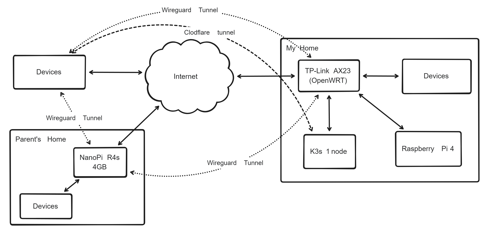

+++
title = "Homelab"
description = ""
date = "2024-12-07"
+++

I've post about [write a kubernetes contoller](@/posts/2024-11-19_cloudflare-tunnels-operator/index.md) and said that I have a homelab. Now, I want to tell how I setup my homelab.

## Hardware

My current setup is relatively simple,

- Single node kubernetes cluster with spec
  - AMD Ryzen 3 4100 4c/8t
  - 16 GB RAM
  - 512 GB Nvme SSD
  - 4TB HDD
- TP-Link AX23 with OpenWRT installed
- A Raspberry Pi 4 4GB for Tvheadend

## Networking


*Network diagram of my homelab*

Networking in my homelab is primarily divided into my parent's home network and my home network which is divided into default, guest, IoT, Wireguard, and OpenVPN that have their own firewall rule.

```text
Parent's Home 192.168.1.0/24
Home default  192.168.2.0/24
Home guest    192.168.3.0/24
Home IoT      192.168.4.0/24
Wireguard     192.168.100/24
OpenVPN       192.168.101/24
```

My home default network can other networks but the IoT and guest network can only access the internet for security reasons.

There are 2 router, ONT from ISP which I can't remove, and TP-Link AX23 which I install with OpenWRT. Since having 2 router is annoying, I enable DMZ on ISP router pointing to my own router and disable NAT on ISP router to prevent issue that occur when using double NAT.

### Tunnels

There are 3 type of tunnels I use, Wireguard VPN and OpenVPN, and Cloudflare Tunnel, each have their own usecases. Wireguard is the default tunnel, OpenVPN is when using Wireguard is impossible, and Cloudflare Tunnel is for public access like this blog.

## Kubernetes

### GitOps

GitOps is the main reason why I chose to use kubernetes instead of docker, having a single source of truth for the state of my services is really nice. I could achive GitOps using docker with portainer but I want to deep dive into kubernetes and installing k3s is easy enough. I use FluxCD as my GitOps because it looks simpler than ArgoCD and have everything I need.


### Load Balancer

There are multiple way to access kubernetes services from outside cluster,
