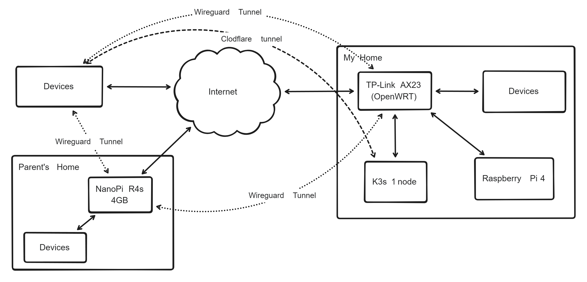

+++
title = "Homelab"
description = ""
date = "2024-12-07"
draft = true
+++

I've post about [write a kubernetes contoller](@/posts/2024-11-19_cloudflare-tunnels-operator/index.md) and said that I have a homelab. Now, I want to tell how I setup my homelab.

## Hardware

My current setup is relatively simple,

- Single node kubernetes cluster with spec
  - AMD Ryzen 3 4100 4c/8t
  - 16 GB RAM
  - 512 GB Nvme SSD
  - 4TB HDD
- TP-Link AX23 with OpenWRT installed
- A Raspberry Pi 4 4GB

## GitOps

GitOps is the main reason why I chose to use kubernetes instead of docker, having a single source of truth for the state of my services is really nice.

## Networking


*Network diagram of my homelab*

Networking in my homelab is primarily divided into my parent's home network and my home network which is divided into default, guest, IoT, Wireguard, and OpenVPN that have their own firewall rule.

```
Parent's Home 192.168.1.0/24
Home default  192.168.2.0/24
Home guest    192.168.3.0/24
Home IoT      192.168.4.0/24
Wireguard     192.168.100/24
OpenVPN       192.168.101/24
```

My home default network can access IoT network but the opposite can't
