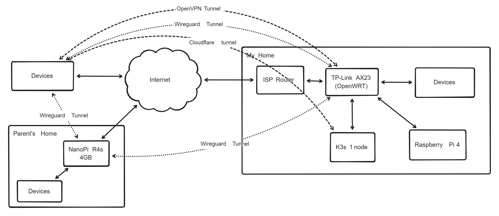

+++
title = "My Homelab Setup"
description = "Physical server right at home"
date = "2024-12-08"
+++

I've post about [write a kubernetes contoller](@/posts/2024-11-19_cloudflare-tunnels-operator/index.md) and stated that I have a homelab. Now in this post, I want to explain how I my homelab is configured.

## Hardware

The first hardware I use for my homelab is my brother's old personal computer, after installing the memory and power supply it served me for a few months. Then because my laptop starts to feel really slow, I repurpose it into my personal computer for work so I bought a Raspberry Pi 4GB to replace it. After some time, I built a new PC to upgrade from Raspberry Pi and currently it consists of

- Single node kubernetes cluster with spec
  - AMD Ryzen 3 4100 4c/8t
  - 16 GB RAM
  - 512 GB Nvme SSD
  - Nvidia GTX 1050 Ti
  - 4TB HDD
  - Ubuntu Server OS
- TP-Link AX23 with OpenWRT installed
- A Raspberry Pi 4 4GB

## Networking


*Network diagram of my homelab*

Networking in my homelab is primarily divided into my parent's home network and my home network which is divided into default, guest, IoT, Wireguard, and OpenVPN that have their own firewall rule. 

```text
Parent's Home 192.168.1.0/24
Home default  192.168.2.0/24
Home guest    192.168.3.0/24
Home IoT      192.168.4.0/24
Wireguard     192.168.100/24
OpenVPN       192.168.101/24
```

Except for IoT and guest subnets which can only access internet for security reasons, the other subnets can access each other. There are 2 router in this network, ONT from ISP which I can't remove, and TP-Link AX23 which I install with OpenWRT. Since having 2 router is annoying, I enable DMZ on ISP router pointing to my own router and opening any port can be done only in my router. I also disable NAT on ISP router to prevent issue that occured when using double NAT.

### Tunnels

There are 3 type of tunnels I use, Wireguard VPN and OpenVPN, and Cloudflare Tunnel, each have their own usecases. Wireguard is the default tunnel, OpenVPN is used when using Wireguard is impossible, and Cloudflare Tunnel is used for public access like this blog.

## Kubernetes

I'm using [k3s](https://k3s.io) for the kubernetes distribution. It's a simpler and lighter to run kubernetes especially if you only have single node.

### GitOps (FluxCD)

GitOps is the main reason why I chose to use kubernetes instead of docker, having a single source of truth for the state of my services is really nice as I can declare almost everything as a file. I probably could achive GitOps using docker with portainer but I want to deep dive into kubernetes and installing k3s is easy enough. I decided use FluxCD as GitOps because it looks simpler than ArgoCD and have everything I need.

### Core Components

There are a lot of components to run if you're runnin kubernetes cluster, some of the core components are

- [traefik](https://traefik.io): modern reverse proxy and ingress controller, almost all of my HTTP(s) services served by traefik
- [external-secrets](https://external-secrets.io/latest/): kubernetes operator that integrate external secret managements, I use it with 1password connect
- [cert-manager](https://cert-manager.io): cloud native certificate management to request HTTPS certificate from letencrypt
- [metallb](https://metallb.universe.tf): a bare metal loadbalancer for exposing service to outside cluster inside my network, I reserved IP address `192.168.2.200-192.168.2.255` and set dhcp range to `192.168.2.199` on the router
- [k8s-gateway](https://github.com/ori-edge/k8s_gateway): coredns plugin to resolve kubernetes external resources, I added dns forwarding for an internal dns to this component.
- [cloudflare-tunnels-operator](https://github.com/mfadhlika/cloudflare-tunnels-operator): for exposing services to public


#### Directories

```text
kubernetes
├── clusters        # core flux components
│   ├── home        # home cluster
│   └── ...         # other clusters
├── apps            # applications
│   ├── base        # reusable components
│   ├── home        # home apps
│   └── ...         # apps on other cluster
└── repositories    # apps repositories
```

The git repositores has above structures, it structured to support multiple cluster in single repository, allowing to use reusable components to deploy in multiple clusters.

## What's Next

I'm pretty happy with current setup, single node is more than enough to serve my purposes. Though I would improve some of it if I've given the chances

- I start run out of storage and I want to have storage in separate device like NAS server rather than mounter directly on the node.
- Installing Home Assistant on the Raspberry Pi, working with IoT seems a lot of fun though it may be expensive.
