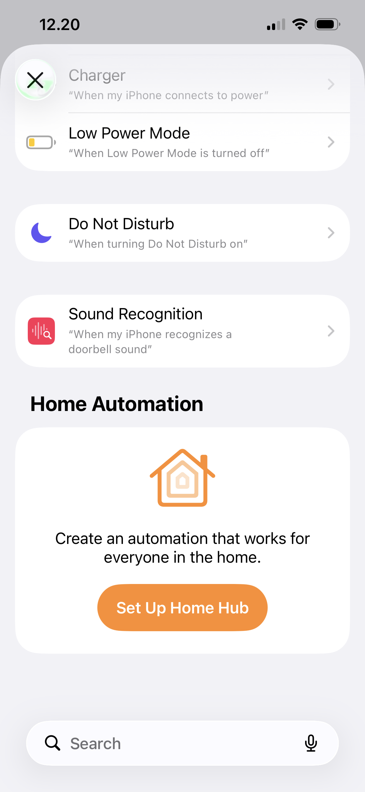

+++
title = "Shortcuts"
description = "My favorite iOS feature and a reason why I'm using iOS"
date = 2026-01-01
+++

Shortcuts is my favorite feature and a major reason why I'm using iOS instead of Android.

## Self-hosted companion

I self-host many open source projects on my homelab. Many open source projects are single developer hence many of then don't have mobile app. For example, I'm self-hosting [linkding](https://linkding.link/), a minimal bookmark manager which don't have official mobile app, even though community-made app exists I don't like using it and the web is good enough for my needs. THe problem is, without mobile app the only way to add a bookmark into linkding from my iPhone is by opening the web, click add bookmark, input the link, tags and other optional details then click save. This is pretty annoying since I have to switch tab to linkding and switch the tabs back, moreover when I'm watching videos on YouTube app, reading articles on RSS reader or some link my friend share on Discord.

Luckyly, many self-hosted project have API available and there comes when Shortcuts is useful, you can have a Shortcuts appear on share sheet and do anything you want with it. For situation above, I created a Shortcut to save the link shared from Share Sheet to linkding using REST API, then I add a prompt to set whatever tags I want the article to have. Since the input is Share Sheet, it will show in whatever apps I'm on as long as they support share.

## Mini-apps

Many small things in daily life don't have app and for good reason. Here in my country tap water is not safe to drink thus we order mineral water in a jug and cooking is mostly using liquified pertoleum gas packaged in a cylinder instead of gas pipe running to my home. I need to order those things everytime they ran out by messaging the shop to deliver them to my home. I usually do this by open whatsapp, find the chat, copy the previous message, modify a bit and then tap send. It was easy enough, except as a Software Engineer, I like to over-engineer stuff sometimes, If I can order with only one tap, why do I need to do those repetitive stuff every time?

With Shortcuts, we can create a "mini-app" to simplify the order.

Sure, above videos have multiple taps but it still has less steps, I can hardcode the value and it will be 1 tap anyway.

## Automation

When I was working from office, I constantly need to set my status to commute so collegue know I can't respond right away. Shortcuts have automation trigger when I leave or arrive at certain place, I can have automation that trigger every time I leave for work and set my status to commute and clear it when I'm arrive. The triggers are customizable of course, I can have manual trigger, WiFi status, Carplay connection, time of day and many more.

  
  
  

The action my differ from platform to platform, for example my company back then use Discord so I can't really set the status automatically since Discord don't have API or Shortcuts actions, Slack provide an API but no Shortcuts actions so we can call the API on Shorcuts action similar to calling REST API for linkding.

Other instance is when I'm still playing Arknights a gacha game where you have limited resources to upgrade your characters or base. I put my resources in a spreadsheet to track them, so I can easily plan my characters/base upgrade. For that purpose I create an automation then open the spreedsheet everytime I close the game so I remember to update my resources on the spreadsheet. There are many other idea I have for automation that I still not implemented yet. One of the is turn on AC on living room when I'm close to home from some trip so I arrive on my room already cool since I live in a very hot area.

## Limitations

Shortcuts is not perfect, you will hit the limitation pretty fast so you will need some workaround. But there are many apps that will fill the gaps like [Pythonista](https://omz-software.com/pythonista/docs-3.4/py3/ios/shortcuts.html) and [Data Jar](https://datajar.app/), even if those apps are not enough I can self-host [Node-Red](https://nodered.org/) or [n8n](https://n8n.io/) and have Shortcuts only for triggers.
